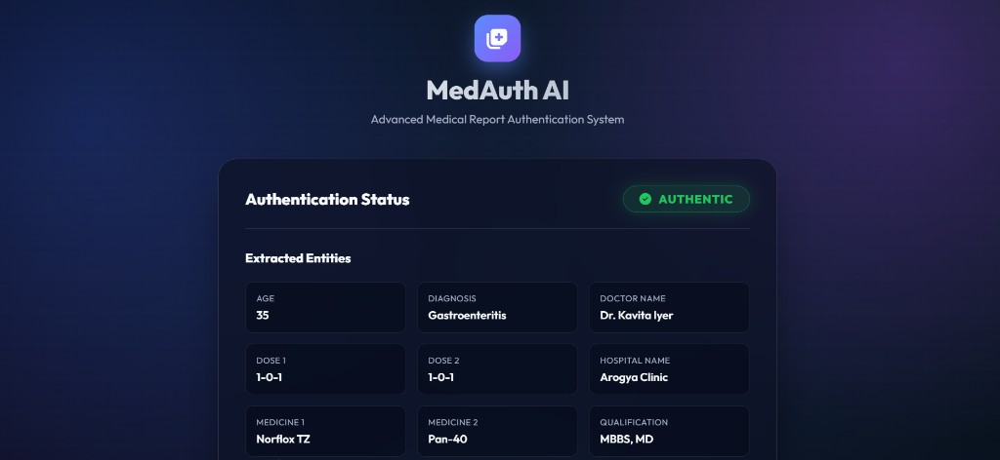

# 🏥 AI-Based Medical Report Authentication System

> 🤖 Detect fraudulent medical reports using OCR, Machine Learning, and rule-based validation with explainable scoring.

---

## 🔗 Live Demo
🚧 Coming Soon (Deploy on Render/AWS)

---

## 📸 Project Preview

### 🧾 Upload Medical Report


### 📊 Prediction Output


---

## 💡 Problem Statement

Medical fraud is a serious issue in healthcare and insurance systems. Fake prescriptions and manipulated reports can lead to:

- Financial fraud 💰  
- Incorrect treatments ⚠️  
- System abuse 🏥  

This project aims to **automate the detection of suspicious medical documents using AI**.

---

## 🚀 Features

- 📄 Upload PDF/Image medical reports  
- 🔍 OCR-based text extraction (PyTesseract)  
- 🧠 Machine Learning classification (Random Forest)  
- 📊 TF-IDF feature engineering  
- ⚠️ Rule-based anomaly detection  
- 📈 Explainable scoring system  
- 🌐 Flask web interface  

---

## ⚙️ How It Works

1. 📥 User uploads a medical report  
2. 🔍 OCR extracts raw text  
3. 🧹 Text preprocessing (cleaning, tokenization)  
4. 📊 TF-IDF converts text → numerical features  
5. 🧠 Random Forest model predicts authenticity  
6. ⚠️ Rule-based checks detect anomalies  
7. 📈 Final result with confidence score + explanation  

---

## 🧠 Model Details

- **Algorithm:** Random Forest Classifier  
- **Feature Engineering:** TF-IDF + Rule Indicators  
- **Classes:**  
  - ✅ Professional (Genuine)  
  - ⚠️ Suspicious (Fraudulent)  

---

## 📊 Dataset

- Synthetic + custom-generated dataset  
- Designed to simulate real-world fraud scenarios:
  - Missing doctor details  
  - Invalid formats  
  - Suspicious keywords  
  - Inconsistent structure  

> ⚠️ Note: This dataset is not from real hospitals and is used for learning purposes.

---

## 📁 Project Structure


├── app.py
├── model/
│ ├── model.pkl
│ └── vectorizer.pkl
├── utils/
│ ├── ocr.py
│ ├── preprocessing.py
│ └── rules.py
├── templates/
├── static/
├── uploads/
└── requirements.txt


---

## ▶️ Installation

```bash
git clone https://github.com/nikhilajmera0123/Ai-Based-Medical-Report-Authentication-System
cd Ai-Based-Medical-Report-Authentication-System

pip install -r requirements.txt
python app.py
```
